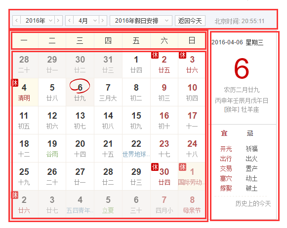
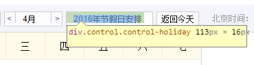
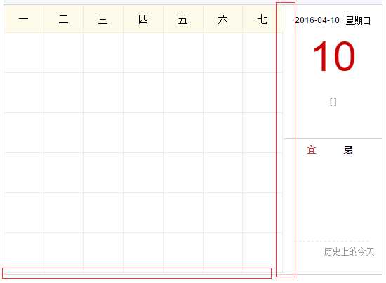

##制作万年历

### 1. 第一天

万年历示例图

####  技术分析 
#####先用html和css布局好静态页面
* 页面分为上下两个部分，下部分分左右两部分，其中左边最上面一行是固定的，下面是日期块加载时生成，选择日期后重新渲染一遍。
* 上面部分可分左右两部分，右边的“北京时间”可根据当前时间获取，可采用字符串拼接方式。
* 选择年、月、日后，右边出现所选择日的详细信息。
 
*下面左边可用表格来实现，七列对应一周七天，也可直接生成浮动的42个div块，样式设定好。
*因为每个月的第一天是周几是不确定的，所以需要JS来动态控制，每个月的总天数也不一样，也需要根据所选择的月来动态计算行数。
#####js要考虑的问题
* 计算所选择月的有多少天
* 计算所选择月的第一天是星期几
* 将所选择月信息渲染到下面左边块里
* 
循环所选月总天数，循环一次在月第一天后渲染一个方格，直到循环完，再根据上月自减和下月自加的方式把其他格式内容补齐

###第二天
####JS是如何获取当前日期的

    var myDate = new Date();
    myDate.getYear();
    myDate.getFullYear();
    myDate.getMonth();
    myDate.getDate();
    myDate.getDay();
    myDate.getTime();
    myDate.getHours();
    myDate.getMinutes();
    myDate.getSeconds();
    myDate.toLocaleDateString();
    
  
####页面初加载时，将当天信息渲染到页面中
在JS未写完整之前，可先直接用当前时间将页面渲染好，等写完JS代码后再将代码整合。
####布局时遇到的问题
**1.**整体上面出现空白
在给万年历下右部分布局时，整个高为`383px`, 右边三部分高已经分别设置，第一部分设置高为`190px`,不过显示时却要比实际的高度要高，如果给每部分都设置绝对定位，对我而言是比较麻烦的。
解决的方法是：给右边部分整体设置为flex布局，`flex-direction: column;`,这样处理后第一部分便显示正确了。
问题的原因：
刚开始以为之前的部分有margin值，把它给挤下来了，查看之后发现相邻元素并没有多出的margin。
查看整体部分的margin, padding，也没有margin和padding值对它影响。
另一点是上、中、下三部分的高相加小于整体的高，在我看来三部分高的和即使小于整体的高，也应该是从顶部往下来排的，不应该最上面有空白。我的这一认识不知道是否正确，不过感觉问题应该就是出在这里，所以便使用了flex布局，然后设置主轴方向从上往下排，结果显示正确。由此看来，之前的认识应该是错的。
  
**2.**布局时出现的另一个问题

字体部分宽度设置的为`88px`，但显示时却显示`93px`, 这样本来应该显示`108px`却显示成了`113px`。

###第三天
####开始写JS部分
#####1. 根据获取到的当前时间把右上角的北京时间做出来，重点是时钟显示实时时间，主要使用JS的定时器，时间定为1s。
 
#####2. 根据获取到的当前时间把页面渲染出来
 

###第四天
####1. 重新梳理了万年历实现步骤
1.获取日期信息年和月（默认为当前的年和当前月）
2.计算出当前月有多少天和本月1号是星期几
3.输出日期的头部信息（标题和表头）
4.循环遍历输出日期信息
5.上一月，下一月

####布局时遇到的小问题
#####1.生成左边格子时，li宽设为14%，最右边会有间隙

自己的解决办法：循环42个方块，对7取余为0时找到所有行末最右方块，对它们进行样式设置
#####2.日期列表最下面一行也同样有间隙问题
解决方法：找到最后七个方块，对它们的样式进行设置

###第五天
####1. 日期选择按钮实现生成下拉列表，点击显示隐藏功能
写一个绑定事件函数，将按钮添加点击的绑定事件
####2. 日期列表里将前后空白方块（即上一月和下一月部分）填充完，并实现背景颜色、字体颜色、样式透明度等样式
遇到的问题: 将上一月和下一月部分的日期块设置背景颜色及透明度之后，发现点击其他月份时，之前加在日期块上的样式仍然存在，虽然内容改变，但样式却仍然保留了之前所加的样式。
解决思路： 这其实就是在一个月份页面给日期块加了样式，但在下一个月份块的时候，由于只是把内容给改变了，之前添加的样式并未清除才会造成这种效果。
解决方法：在重新渲染时，将之前的日期块样式全部重置，需要加时再添加。
####3. 让日期列表显示农历信息
最开始自己的想法是渲染一个表格时就将农历信息添加进去，最后发现这种方法很烦琐。
最后自己选择了，先将公历几号渲染进去，将每一个日期块的公历日期字符串（例如‘20160415’）存在一个数据里，当月时直接一个个push进去，前面的上月部分循环一个个往数据里unshift，后面的下月部分仍然是循环那些日期块将每个日期块的公历信息往数组里push。
这样，将公历日期（每日）渲染进日期块时，42个日期块的公历信息就全部添加到数据里了，将数据循环，根据取出的日期得到农历信息渲染到42个日期块里。
#### 4. 让右边的农历信息显示出来
右边部分，需要显示的信息有公历日期，农历日期，天干地支信息，及生肖信息。
主要的难点是对于天干地支信息不太熟悉，因此为了搞懂这块也算是耽误了不少时间。
####简单部分基本实现
#####1.重新整理一下思路
发现之前做时，没有考虑用对象的方式，就是不断的写函数，不断的调用。后来发现其实可以直接写在一个calendar对象上，将方法加载到对象下面，直接调用对象下面的方法也可以，而且这样对以后的扩展更好一点。于是将之前做的大部分的再重新舍弃，换上对象。
日期对象，有获取时间，设置时间，获取阴历日期，获取当月阴历的天数，将阴历与阳历对应起来，显示阴历时，主要是将阳历对应的阴历信息找出来，显示在页面上。

####2.代码精简

###第六天
摘自网上的干支计算
六十干支顺序表：
甲子。乙丑。丙寅。丁卯。戊辰。己巳。庚午。辛未。壬申。癸酉。
甲戌。乙亥。丙子。丁丑。戊寅。己卯。庚辰。辛巳。壬午。癸未
甲申。乙酉。丙戌。丁亥。戊子。己丑。庚寅。辛卯。壬辰。癸巳
甲午。乙未。丙申。丁酉。戊戌。己亥。庚子。辛丑。壬寅。癸卯
甲辰。乙巳。丙午。丁未。戊申。己酉。庚戌。辛亥。壬子。癸丑
甲寅。乙卯。丙辰。丁巳。戊午。己未。庚申。辛酉。壬戌。癸亥。
干支推算年份
由于天干地支每60年一循环，所以不能直接根据干支计算对应的年份数值。但是可以根据干支计算出对应于60年中的第几年，从而进一步推算。
设x为天干对应的次序，甲-癸依次为1-10；y为地支对应的次序，子-亥依次为1-12.那么对应次序z的计算公式为：
z = 6x - 5y，
（如果为负，可再加60。）如庚辰年，庚7*6-辰5*5=庚辰17
 
公历日期推算当日年月日时干支
 
注意：以下年月日干支公式使用计算使用公历日期时，要考虑到月干支是随着农历二十四节气中的节气（非中气）交接变化的。而每月月初节气未来时，月份干支不会变化，也就是每月1到8号之间，下一个节气来交接时，月份干支才会变化，故这几天当算上一月，月数要用上月公历月月数，日数要用上月最后一天日数加当日公历日数；又年干支是在立春节气交接的，但公历年份数字在元旦到来日即会变1位，故从1月1号元旦到本年立春前的年份数应用上一年的公历年份数，月数要加11使用，日数要用当日数加上月最后一日的公历日数使用。因为月数变化随节气在1到8号之间，而往往没记住节气在几号，因此这几日还是要去查万年历，不用公式；而保险使用公式时最好要避开这几天才好。
 
一.年份转干支的近视计算：1.公元后（1）用公元年的尾数查下表得知年干，用年份除以12的余数查下表知其年支。例如1995年尾数5查得知为乙，用年份（1995年）除以12的余数为3查表的知3为亥，所以1995年为乙亥年。
天干：甲 乙 丙 丁 戊 己 庚 辛 壬 癸
尾数： 4 5 6 7 8 9 10 1 2 3
地支：子 丑 寅 卯 辰 巳 午 未 申 酉 戌 亥
余数： 4 5 6 7 8 9 10 11 12 1 2 3
(2)使用下面的除法求余数定天干地支：
天干：甲 乙 丙 丁 戊 己 庚 辛 壬 癸
余数： 1 2 3 4 5 6 7 8 9 10
地支：子 丑 寅 卯 辰 巳 午 未 申 酉 戌 亥
余数：1 2 3 4 5 6 7 8 9 10 11 12
因为在公历里任何年份减3除以10所求的余数等于该公历年份的末尾数减3，可以用公式“年干余数=公历年末尾数-3”，这时年支的余数=（公历年份-3）/12的余数；如1911辛酉年干（末尾数小于3借10）余数=11-3=8对应辛，（1911-3）/12余数=0（地支余数为0就以12为余数）对应酉；另遇求天干余数=0时以10为其余数。
2.公元前：用下面的干支配数对年份天干地支，年干支等于公历年份尾数，年地支等于公历年份除以12的余数，如公元前221年为庚辰年
天干：甲 乙 丙 丁 戊 己 庚 辛 壬 癸
尾数：7 6 5 4 3 2 1 10 9 8
地支：子 丑 寅 卯 辰 巳 午 未 申 酉 戌 亥
余数：9 8 7 6 5 4 3 2 1 0 11 12
二。月份的干支计算：
1.干支纪月的推算较为容易，每年的各月地支已经固定，只要推算月的天干一配就行。五年一循环，周而复始。有歌诀为证：
甲己之年丙作首，乙庚之岁戊为头；
丙辛必定寻庚起，丁壬壬位顺行流；
更有戊癸何方觅，甲寅之上好追求。
2.年干数*2+公历月数-1=月干数，超过10要减掉10只取一个数，月支固定不变用下面的配法：
正月 二月 三月 四月 五月 六月 七月 八月 九月 十月 十一月 十二月
寅 卯 辰 巳 午 未 申 酉 戌 亥 子 丑
如1935乙亥年的7月9日对应其农历6月初9的月干支为癸未。
注意：以上两法均应明确干支纪月的地支是以二十四节气为首，直到下一个节气为止，中间有一个中气为一个月，以节气交接时间为起始的一月期间。不是公历和农历月起始期间。
三.日干支计算：
G(天干）=4*C+C/4(商取整数）+5y+y/4(商取整数）+[(3*(M+1)/5](商取整数）+d-3
Z（地支）=8C+C/4(商取整数）+5y+y/4(商取整数）+[(3*(M+1)/5](商取整数）+d+7+i
注：C世纪数 y年份后两位 M月份 d日数 i=0（奇数月） i=6（偶数月）
日干数=G/10的余数日支数=Z/12的余数例如2006年4月1日G/10的余数是7，Z/12的余数是9,7为庚，9为申该日日柱即为庚申。上面公式简化Z=G+4C+10+i.

###总结
1. 开始认为这个任务不太难，另外由于其他事情比较紧，所以并没有从一开始重视起来。每天用来做它的时间也只在晚上做点，中间有两天甚至由于其他事没去做。这样导致的结果就是下次接着做的时候要重新将之前做的再看一遍，理清上次的思路，比较浪费时间。对于天干地支、24节气那块，一直搞不情究竟是如何计算的。
2. 最初没有思考，就是不停写各种方法函数，后来发现写的太乱。最后选择将方法加载到日期对象上，重新写，感觉这种方式应该是对的，以后应该多培养下这种模式。
3. 从自己写的代码来说，质量还是不高，仍然有许多地方需要精简，这是一个慢慢积累总结的过程，希望自己能坚持。
4. 决定任务后，应该对任务有一个时间规则，按照规则每天检查自己的进度，这样才不会像这次这样虽然开始的早，却拖到最后一天才紧赶慢赶地完成基础要求。

