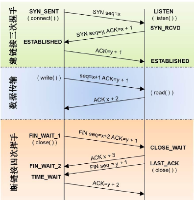
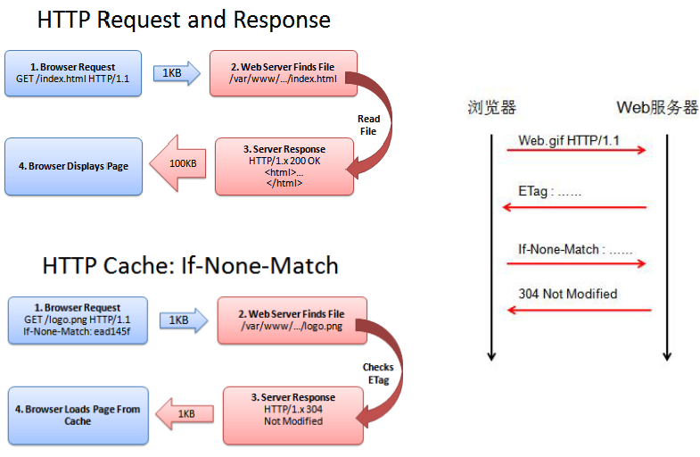
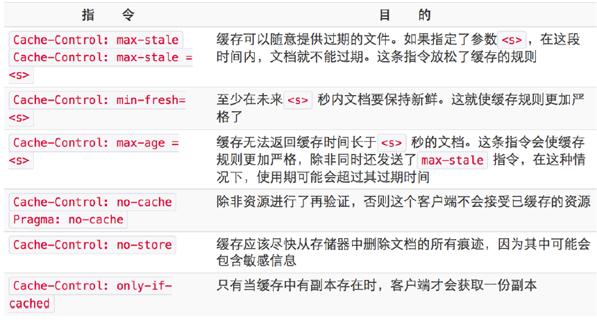

#theSecondDay

##HTTP与性能优化
[屈光宇](https://imququ.com)： 目前负责360搜索前端组

屈屈从一道经典的面试题：“从输入URL到页面加载完的过程中都发生了什么事情”开始。
###HTTP技术简介

HTTP在浏览器网络中的位置

TCP的三次握手

####HTTP是什么
HTTP是应用层协议；联网细节交给了通用的、可靠的因特网传输协议：TCP/IP
####什么是URL

> `<scheme>://<user>:<password>@<host>:<port>/<path>;<params>?<query>#<frag>`

>`http://<host>:<port>/<path>?<query>#<frag>ftp://<user>:<password>@<host>:<port>/<path>;<params>`

####什么是HTTP状态码

####Header分类
- 通用
	- `Date: Tue, 3 Oct 1974 02:16:00 GMT`
	- `Connection: close`
- 请求
	- `User-Agent: Mozilla/5.0 (Linux; U; Android 4.0.2; en-us;Galaxy Nexus Build/ICL53F) AppleWebKit/534.30(KHTML, like Gecko) Version/4.0 Mobile Safari/534.30`
	- `Accept: */*`
	- `Accept-Encoding:gzip, deflate, sdch`
- 响应
	- `Server: Nginx`
	- `Last-Modified: Thu, 16 Oct 2014 10:15:16 GMT`
- 实体
	- `Content-Type: text/html; charset=utf-8`
	- `Content-Length: 100`
- 扩展（自定义）
	- `X-Powered-By: thinkjs-1.0.4`
	- `X-Varnish-Hits:5`

####总结一下HTTP请求-响应过程
1.浏览器从URL中解析出服务器的主机名；
2.浏览器将主机名转换成服务器的IP地址；
3.浏览器从URL中解析出商品号，默认80；
4.浏览器建立一条与服务器的TCP连接；
5.浏览器向服务器发送一条HTTP请求报文；
6.服务器向浏览器返回一条HTTP响应报文；
7.关闭连接，浏览器显示文档；
####HTTP抓包工具
- Wireshark
- Fiddler
- Firebug for Firefox
- Chrome 开发者工具
- IE8+ 自带的开发者工具

####HTTP发包工具
- telnet / curl
- Fiddler *
- Tamper for Firefox
- Postman for Chrome *
- Paw for OSX
##HTTP历史回顾
**Hypertext Transfer Protocol**

**SPDY ？（2012 - 2015）**

##HTTP性能优化

**Web Performance Optimization**
如何的Web是Web应用，而不是Web页面，**多媒体和多设备支持，SPA**

####HTTP 请求-响应模型

**一个TCP连接上同时只能有一个请求/响应**
####Keep-Alive

第一次请求有两次往返延迟；后续请求只有一次往返延迟；减少TCP慢启动带来的影响；
####同域并发限制
RFC2616:同域名同时只能有2个连接（RFC7230中去掉了限制）；
现代浏览器： 一般允许同域6个并发连接；
####域名散列

####协议开销

####模块拆分导致更多请求

####合并请求
- 异步接口合并（Batch Ajax Request）;
- 图片合并，雪碧图（CSS Sprite）;
- CSS、JS合并（Concatenation）;
- CSS、JS内联（Inline）;
- 图片、音频内联（Data URI）;
- ......
####压缩
- 代码压缩（）；
- 图片压缩（无损、有损）；
- 服务端开启GZip（文本类资源）；
- 具体业务的压缩（去掉冗余代码、精简异步接口）；
- ......
####Last-Modified

####ETag

####Expires

####Cache-Control

####浏览器请求的有三种方式
- 在地址栏回车、点击链接：使用全部缓存； **200 from cache**
- F5 / cmd + r: 忽略Expires和Cache-Control，发起协商请求；**304**
- Ctrl + F5 / cmd + shift + r: 忽略所有缓存；**200**
#####阻塞渲染

####样式内联

####感知缓存的样式内联

####感知缓存的样式内联的收益

####性能优化小结
一个TCP连接上同时只能有一个请求/响应：
- 开多个TCP（同域名最多6个）
	- 域名散列（DNS开销、TCP慢启动、TCP额外开销、缓存失效）
- 减少请求数
	- 合并请求或资源（木桶效应、内存消耗、解析时间变长、缓存失效）
HTTP头部没有压缩，大量重复头部造成额外消耗：
- 减少请求数
- 启用Cookie-Less域名
需遵守一个请求一个响应的模式，无法推送重要资源：
	- 重要CSS放在头部，JS放在底部
	- 资源内联
###如何衡量性能指标？
####页面加载时间点

####用户心理
		- 让用户更快看到主体内容：异步加载/按需加载；BigPipe;
		- 让用户知道当前状态：加载提示；进度条；
		- 让用户感觉更快：占位图/预读/行为预判；
####HTTP性能指标
- HTML5 Performance API: **DNS/TCP/TTFB**
- 服务端日志：**request_time / upstream_response_time**
- 业务打点：**头部资源加载时间；首屏时间/可用时间；**
####HTTP瀑布图

####HTTP性能测量工具
- 浏览器扩展：**YSlow; PageSpeed;**
- 在线资源：
	http://www.webpagetest.org/
	https://developers.google.com/speed/pagespeed/insights/
https://gtmetrix.com/
http://pagevalid.qiwoo.org/

####推荐书籍

